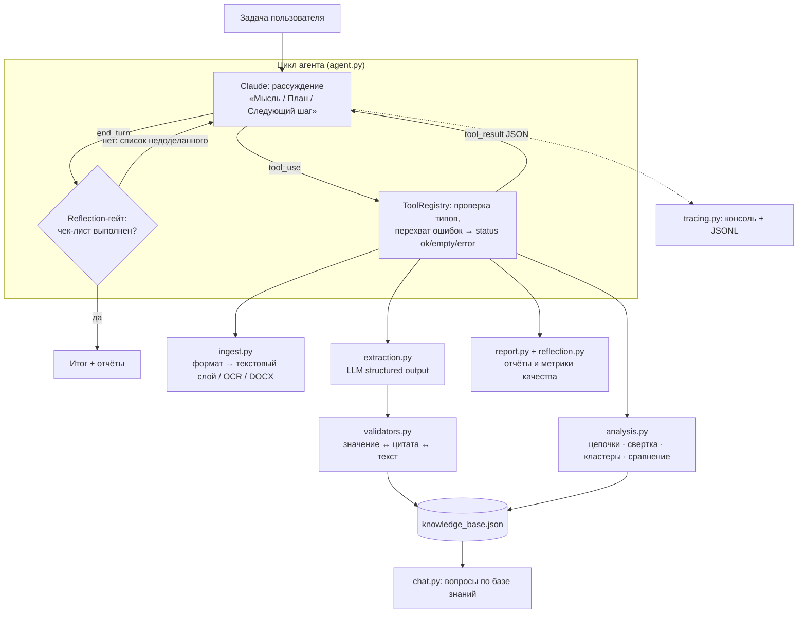

# Агент-аналитик цепочек и кластеров договоров

ИИ-агент на Claude с инструментами (tool use) разбирает пакет договорных документов: основные договоры,
дополнительные соглашения (ДС), самостоятельные соглашения, в том числе сканы. Агент:

1. **распознаёт** документы и сам выбирает метод чтения по формату: текстовый слой PDF, OCR сканов и изображений
   через vision-модель, DOCX, TXT;
2. **извлекает карточки** (номер, дата, родительский договор, предмет, существенные условия, изменения)
   и **проверяет значения по тексту**. Неподтверждённые значения не записывает и явно помечает как отказ;
3. **связывает** документы в цепочки «договор → ДС» по номерам, а не по папкам. Учитывает ДС к ДС,
   отмену ДС другим ДС и договоры, которых нет в пакете;
4. **кластеризует** договоры по предмету и другим параметрам и описывает различия внутри кластеров;
5. **сворачивает** условия: собирает актуальную редакцию каждого договора с учётом действующих ДС
   (без отменённых, истёкших и ещё не вступивших) и показывает, как менялось каждое условие;
6. формирует **краткий Markdown-отчёт** (и детальный), **проверяет по чек-листу**, что план выполнен
   (reflection), и считает метрики качества своей работы;
7. в режиме **чата** отвечает на вопросы по собранной базе знаний, помнит диалог между запусками.

> **Данные.** Документы заказчика тестового задания в репозиторий не входят. Все примеры в `examples/`
> построены на синтетическом пакете ([`examples/synthetic_package/`](examples/synthetic_package/)):
> вымышленные компании, номера и суммы, но те же сложные случаи, что встречаются в реальных пакетах.

---

## Соответствие тестовому заданию

| Требование ТЗ | Как реализовано | Где посмотреть |
|---|---|---|
| Агент выбирает инструменты сам | Управляемый ReAct-цикл: модель на каждом шаге решает, какие из 12 инструментов вызвать, как читать файл, по каким признакам кластеризовать, когда перечитать документ через OCR. Типичный порядок этапов подсказан промптом, а предусловия зашиты в инструменты (цепочки без карточек не строятся — агент получает ошибку с подсказкой) | `agent.py`, `prompts.py`, [журнал прогона](examples/live_run/console_output.txt) |
| Выбор по формату входных данных | `list_documents` определяет формат (pdf_text / pdf_scan / pdf_mixed / docx / text / image / unsupported / corrupted), агент выбирает `method` в `parse_document` | `ingest.py` |
| Кластеризация по предмету и иным параметрам | Договоры — по предмету, форме контрагента, городу, статусу, комплектности, числу ДС; документы — по типу и области изменений. Различия внутри кластера — кодом и комментарием агента | раздел 3 [отчёта](examples/live_run/report.md) |
| Агрегация ДС и договоров в сводку | `link_contract_chains` + `consolidate_contract` + `get_contract_summary` | раздел 4 отчёта |
| Краткий отчёт: кластеры, различия, эволюция условий | `report.md` (краткий) + `report_full.md` (полная история версий) | [report.md](examples/live_run/report.md) |
| Схема данных | Pydantic: ответ модели (`DocumentExtraction`) и проверенные данные (`DocumentCard`, `Contract`, `ConsolidatedTerms`) | `schemas.py` |
| System prompt с Chain of Thought | Блок «Мысль / План / Следующий шаг» перед каждым вызовом + сводка рассуждений модели | `prompts.py` |
| Память и чат | База знаний в JSON + история диалога по сессиям | `knowledge_base.py`, `chat.py`, [примеры](examples/live_run/chat_examples.md) |
| Обработка пустых результатов и ошибок | `status: ok / empty / error` + `hint`; исключения и неверные типы аргументов не роняют агента; лимиты на шаги, раунды reflection и деньги | `tools.ToolRegistry.execute`, тесты |
| Логирование хода мыслей | Консоль + JSONL: `thinking`, `thought`, `tool_call`, `tool_result`, `reflection` | `tracing.py` |
| Отказ от записи неуверенных / противоречивых значений | Значение сверяется с текстом и со своей цитатой (см. таблицу ниже); отказ пишется с причиной и исходным значением | `validators.py`, раздел 6 отчёта |
| Reflection | Чек-лист из 11 пунктов считает код; при невыполнении агент возвращается к работе (до 2 раундов); `analyze` возвращает код 1, если план так и не выполнен | `reflection.py`, раздел 7 отчёта |
| Тестирование | 46 тестов без API; оценка на синтетическом пакете против эталона, сгенерированного до прогона | `tests/`, [evaluation.md](examples/live_run/evaluation.md) |

---

## Быстрый старт

```bash
cd contract-agent
python -m venv .venv
.venv\Scripts\activate          # Linux/macOS: source .venv/bin/activate
pip install -r requirements.txt
copy .env.example .env          # Linux/macOS: cp .env.example .env
```

В `.env` — ключ одного из провайдеров:

| Провайдер | Переменные | Модель по умолчанию |
|---|---|---|
| OpenRouter | `CONTRACT_AGENT_PROVIDER=openrouter`, `OPENROUTER_API_KEY=sk-or-...` | `anthropic/claude-opus-5` |
| Anthropic API | `ANTHROPIC_API_KEY=sk-ant-...` | `claude-opus-5` |

Настройки под конкретный пакет (необязательно): `CONTRACT_AGENT_OUR_PARTY` — «наша» сторона договоров
(контрагентом считается другая), `CONTRACT_AGENT_NUMBER_PATTERNS` — регулярные выражения номеров документов через `;;`
(по умолчанию номером считается то, что стоит после «№»), `CONTRACT_AGENT_AS_OF` — дата, на которую строится свертка,
`CONTRACT_AGENT_MAX_COST_USD` — стоп-кран по стоимости (по умолчанию $12).

### Как проверить работу

| Что нужно | Команда | Что увидите |
|---|---|---|
| ничего | `python -m pytest -q` | 46 тестов без API |
| ничего | `python -m contract_agent demo` | весь конвейер на синтетическом пакете с записанными ответами модели → `examples/demo/output/` |
| ничего | `python -m contract_agent evaluate --kb examples/live_run/knowledge_base.json` | качество живого прогона против эталона |
| ключ API | `python -m contract_agent analyze --input examples/synthetic_package/docs --fresh` | живой прогон агента на синтетическом пакете (~$2.5 на Opus 5) |
| ключ API + свои документы в `data/` | `python -m contract_agent analyze` | анализ своего пакета |
| ключ API | `python -m contract_agent chat` | вопросы по базе знаний (например, скопировав `examples/live_run/knowledge_base.json` в `workdir/`) |

Прочие команды: `inventory` (файлы и форматы), `check` (чек-лист reflection), `report --rebuild` (пересчитать цепочки,
свертки, кластеры и отчёты без LLM), `report --revalidate` (перепроверить карточки текущими правилами).
Флаги: `--fresh`, `--model`, `-q` (не печатать ход мысли, журнал пишется всегда), `--task "..."`.

---

## Архитектура



### Пайплайн по шагам

1. **Инвентаризация** (`list_documents`): все файлы с форматом и подсказкой, каким методом читать. Неподдерживаемые
   и повреждённые файлы не пропускаются молча — они попадают в отчёт как нераспознанные.
2. **Чтение** (`parse_document`): агент выбирает метод по формату; код считает метрики качества текста и решает,
   распознан ли документ. Если нет — `status: error` и подсказка, какой метод попробовать.
3. **Извлечение** (`extract_document_card`): модель заполняет JSON-схему `DocumentExtraction` (значение + дословная
   цитата + уверенность), `validators.py` записывает в карточку только подтверждённые значения.
4. **Цепочки** (`link_contract_chains`): связывание по номерам, ДС к ДС, отмена ДС, отсутствующие договоры,
   сверка даты договора с тем, как на него ссылаются ДС.
5. **Свертка** (`consolidate_contract`): применение изменений в хронологическом порядке (правила ниже).
6. **Кластеры и сравнение** (`cluster_contracts`, `compare_contracts`): агент выбирает измерения и объясняет
   различия внутри кластера.
7. **Отчёт и reflection** (`generate_report`, `check_plan_completion`): факты в отчёт выводит код, выводы пишет агент;
   затем формальный чек-лист — если он не выполнен, агент возвращается к работе.

### Почему так устроено

- **LLM решает, код считает и проверяет.** Модель читает юридический текст, заполняет схему, выбирает следующий шаг
  и пишет выводы. Связывание, хронология, свертка, кластеры, сравнение и проверки — детерминированный код,
  воспроизводимый и покрытый тестами без API.
- **Управляемый агент, а не свободный.** Модель выбирает инструменты и их аргументы, но этапы и их предусловия заданы:
  это даёт предсказуемость на юридических данных ценой меньшей свободы.
- **Свой цикл вместо фреймворка.** Нужны журнал мыслей на каждом шаге, параллельные вызовы (документы обрабатываются
  пачками) и reflection-гейт, который модель не может обойти — около 100 строк в `agent.py`.
- **Провайдеры за одним интерфейсом** (`providers.LLMBackend`): `llm.py` (Anthropic SDK: structured outputs, adaptive
  thinking, vision, кеширование промпта, fallbacks) и `llm_openrouter.py` (Chat Completions, `response_format=json_schema`
  с проверкой pydantic, учёт фактической стоимости). История агента хранится в формате Anthropic Messages, бэкенд
  OpenRouter переводит её туда и обратно.

### Проверки значений: когда агент отказывается записывать

| Проверка | Пример отказа |
|---|---|
| цитата есть в тексте (4-граммы слов, порог 60 %) | модель пересказала вместо цитаты |
| номер документа встречается в тексте (после нормализации: без «№», пробелов, вариантов тире) | номер из соседнего документа |
| дата встречается в тексте и правдоподобна | 31.02.2024; дата, которой в документе нет |
| дата «с момента подписания» совпадает с датой документа | цитата про подписание, но дата взята с потолка |
| слова названия контрагента есть в его цитате | «ООО Ромашка» с цитатой про другую компанию |
| каждое число и дата из описания условия/изменения есть в тексте рядом с цитатой (±2500 символов) | «вознаграждение 95%» с цитатой из преамбулы; «ставка 5%», когда в тексте 7% |
| изменяемый документ упомянут в тексте | ДС «меняет» соглашение, на которое не ссылается |
| нет условия об автопролонгации | «действует до 31.12.2023, автоматически продлевается» — это не дата окончания |
| уверенность ≥ 0.7; штраф ×0.6, если значение пересекается с неуверенным фрагментом OCR | рукописная дата на скане |
| ДС ссылаются на разные даты договора, а в самом договоре даты нет | дата договора не записывается |

Что **не** проверяется кодом: смысл формулировок условия (что «отсрочка 45 дней» относится именно к оплате) —
только числа и даты в нём. Противоречия между документами фиксируются, но значения молча не перезаписываются.

### Свертка: правила

- База — существенные условия основного договора; если его нет в пакете, это явно указывается.
- ДС применяются по дате подписания, при её отсутствии — по дате начала действия.
- «Изложить договор в новой редакции» заменяет всю базу. Изменение пункта заменяет положение с тем же пунктом
  (по приложению и номеру, с диапазонами «п. 1.1–1.37», «разделы 1–8» и составными ссылками); если меняется часть
  пунктов положения, оно остаётся с пометкой «частично изменено».
- Одно изменение — одно положение: оно попадает в основное условие (где есть заменяемый пункт), в остальных
  затронутых условиях остаётся только ссылка в истории.
- Не входят в действующую редакцию (но видны в истории): отменённые ДС, истёкшие ДС, ещё не вступившие изменения,
  изменения соглашений, которых нет в цепочке договора. Собственный срок и «прочие условия» ДС в условия договора
  не попадают.
- В кратком отчёте по каждому условию — базовая редакция сверху и дополнения соглашений ниже; вся история —
  в `report_full.md`.

### Обработка ошибок, память, журнал

- Каждый инструмент возвращает `status: ok | empty | error`, при ошибке ещё `error` и `hint`. Исключения и неверные
  аргументы перехватываются в `ToolRegistry.execute` и уходят модели как `tool_result` с `is_error: true`.
- Нераспознанный документ (мало текста, не кириллица, плохой OCR, неподдерживаемый или повреждённый файл) явно
  помечается и попадает в отчёт; работа продолжается.
- Ошибки API (ключ, лимиты, отказ модели, обрезка ответа, исчерпан бюджет) превращаются в `LLMError` с понятным текстом.
- Память: `knowledge_base.json` (долговременная), история чата `workdir/chat/<session>.json` (последние 20 реплик).
- Журнал: консоль и `workdir/logs/*.jsonl`; ключей и полных текстов документов в журнале нет.

---

## Пример: живой прогон на синтетическом пакете

Прогон `anthropic/claude-opus-5` через OpenRouter на синтетическом пакете (13 файлов: 10 текстовых PDF, 2 скана,
1 неподдерживаемый .xlsx): **24 вызова модели, 342 тыс. входных и 28 тыс. выходных токенов, $2.43, план выполнен
с первого раза.** Артефакты — в [`examples/live_run/`](examples/live_run/):

| Файл | Что это |
|---|---|
| [`console_output.txt`](examples/live_run/console_output.txt), [`agent_trace.jsonl`](examples/live_run/agent_trace.jsonl) | консоль и полный журнал событий |
| [`report.md`](examples/live_run/report.md), [`report_full.md`](examples/live_run/report_full.md) | краткий и детальный отчёты |
| [`evaluation_raw.md`](examples/live_run/evaluation_raw.md), [`evaluation.md`](examples/live_run/evaluation.md) | качество против эталона: ответы модели как есть и после проверки, добавленной по итогам прогона |
| [`knowledge_base.json`](examples/live_run/knowledge_base.json) | база знаний (скопируйте в `workdir/` — и можно задавать вопросы в `chat`) |
| [`chat_examples.md`](examples/live_run/chat_examples.md) | 3 вопроса в режиме чата ($0.30) |

### Запрос

```bash
python -m contract_agent analyze --input examples/synthetic_package/docs --fresh
```

с `CONTRACT_AGENT_OUR_PARTY=АО «Вектор Логистик»` и `CONTRACT_AGENT_AS_OF=2026-09-27` в `.env`. Задача по умолчанию
(`cli.DEFAULT_TASK`): распознать документы, кластеризовать договоры и описать различия внутри кластеров, собрать
цепочки и свертки с эволюцией условий, сформировать отчёт и проверить выполнение плана.

### Ход работы (из журнала)

```
шаг 1  Мысль: пакет пока неизвестен, нужна инвентаризация                     → list_documents
шаг 2  Мысль: 10 pdf_text (auto), 2 скана (ocr), 1 xlsx (нераспознаваемый)     → parse_document ×13: 11 auto, 2 ocr
       (xlsx → status: error «формат не поддерживается», работа продолжается)
шаг 3  Мысль: …ДС1 поставки ссылается на договор от 02.02.2022, в договоре — 03.02.2022;
       ДС3 поставки лежит в папке аренды…                                     → extract_document_card ×12
шаг 4  Мысль: нет договора У-77 и соглашения АР-2021/015-С, ДС2 поставки отменено → link_contract_chains
шаг 5  Мысль: 4 цепочки                                                        → consolidate_contract ×4
шаг 6  Мысль: у склада действует 510 000 (ДС3 — только с 01.01.2027)…         → cluster_contracts ×2
шаг 7  Мысль: единственный кластер из 2+ договоров — аренда                    → compare_contracts, cluster_contracts(document)
шаг 8                                                                          → generate_report
шаг 9                                                                          → check_plan_completion → complete = true
```

### Ожидаемый ответ (итог агента, сокращённо)

> - Распознано 12 из 13 файлов (10 через текстовый слой, 2 скана через OCR). Не читается только `Реестр платежей 2024.xlsx`.
> - Построены 4 цепочки: АР-2021/015 (аренда склада, 3 ДС), АР-2023/007 (аренда офиса), П-118/22 (поставка, 4 ДС),
>   У-77 (уборка, 2 ДС без основного договора).
> - Актуально: склад 510 000 ₽/мес (560 000 ₽ по ДС3 — только с 01.01.2027), офис 210 000 ₽/мес, поставка — скидка 8%
>   и оплата 50 дней, уборка — 135 000 ₽/мес (вывоз снега истёк 31.05.2025).
> - Риски: нет основного договора У-77; ДС2 аренды меняет соглашение АР-2021/015-С, которого нет в пакете;
>   противоречие дат договора поставки (03.02.2022 / 02.02.2022); ДС2 поставки отменено ДС3; у склада из-за
>   автопролонгации нет конечной даты (значение отклонено проверкой).

### Вопрос в чате

```bash
python -m contract_agent chat "Какой штраф за просрочку поставки установлен в договоре аренды офиса?"
```

> **Такого условия в договоре аренды офиса нет.** В АР-2023/007 штрафа за просрочку поставки не установлено — это договор
> аренды офисного помещения 180 кв. м (п. 1.1). Единственная санкция — п. 5.1: пени 0,1% за каждый день просрочки
> внесения арендной платы…

### Качество против эталона

| | Поля карточек: верно / неверно / отказ | Изменения | Цепочки | Отменённые ДС |
|---|---|---|---|---|
| ответы модели как есть | 80 / **1** / 0 (+27 пустых в обоих) | 12 из 12 | 4 из 4 | совпадают |
| после проверки «контрагент ≠ наша сторона» | 80 / 0 / 1 | 12 из 12 | 4 из 4 | совпадают |

Единственная ошибка модели: на скане ДС3 аренды контрагентом указана «наша» сторона (АО «Вектор Логистик»), и её
форма «АО» попала в карточку — название действительно было в цитате, поэтому исходные проверки её пропустили. По итогам
прогона добавлена проверка «контрагент не совпадает с `CONTRACT_AGENT_OUR_PARTY`»; база и отчёты пересобраны командой
`report --revalidate` из тех же ответов модели, без повторного обращения к API. Журнал и консоль — из самого прогона.

Документы заказчика тестового задания (16 PDF) агент тоже обрабатывал; эти результаты не публикуются. По ручной
разметке того пакета (размечал автор, часть меток уточнена после сравнения) неверных номеров и дат модель не записала;
одна лишняя дата окончания у договора с автопролонгацией стала поводом для проверки пролонгации. Содержание условий
там не оценивалось.

---

## Офлайн-демо и оценка

```bash
python -m contract_agent demo
python -m contract_agent evaluate --kb examples/demo/output/knowledge_base.json
```

Демо проходит весь конвейер на синтетическом пакете, но вместо модели работает `ReplayLLM` — «кассета» с ответами
([`examples/demo/cassette/`](examples/demo/cassette/)), сгенерированная из той же спецификации, что и документы.
В кассету намеренно заложены шесть типичных ошибок модели, и все они становятся отказами, а не записанными значениями:
дата окончания у договора с автопролонгацией, пересказ вместо цитаты, чужое название контрагента при настоящей цитате,
чужая сумма при настоящей цитате, изменение несуществующего документа, неуверенно прочитанная дата на скане.

**Что значат цифры оценки.** Эталон (`gold.json`) генерируется вместе с пакетом из спецификации — до любого прогона,
подогнать его под ответы нельзя. Сравниваются 9 полей карточки на документ (тип, номер, дата, родительский договор
и его дата, даты начала и окончания действия, форма контрагента, отменённые ДС), отдельно — извлечение изменений
(изменяемый документ + пункт + действие) и структура цепочек. Поля, пустые и в эталоне, и у агента, считаются отдельно
и в «верные» не входят. Содержание существенных условий (формулировки) метрикой не оценивается — его проверяют
валидаторы по числам и датам. Пакет небольшой (13 файлов), поэтому оценка показывает, что проверки работают,
а не статистическую точность.

---

## Известные ограничения

- **Словарь предметов** (`SubjectCategory`) — общие категории из ТЗ (аренда, купля-продажа, услуги) плюс несколько
  прикладных; для новой отрасли его нужно расширить. Нумерация документов по умолчанию — «то, что после №»;
  корпоративный формат номеров задаётся в `CONTRACT_AGENT_NUMBER_PATTERNS`.
- **Проверка условий — по числам и датам**, не по смыслу формулировки.
- **Гранулярность свертки — пункт договора.** Если ДС меняет пункт, которого нет среди существенных условий базовой
  карточки, изменение добавляется отдельным положением (в отчёте — одно сводное примечание на документ).
- **Большие договоры отправляются в модель целиком** (до 600 тыс. символов); для пакетов из сотен документов нужен
  поиск по разделам.
- **Кеш промпта через OpenRouter** срабатывает только на системном промпте; через Anthropic API используется
  автоматический `cache_control`.

---

## Структура репозитория

```
contract_agent/
  agent.py          цикл агента, параллельные вызовы, reflection-гейт
  tools.py          инструменты: JSON-схемы, проверка типов, обработчики, перехват ошибок
  prompts.py        системные промпты
  providers.py      интерфейс LLMBackend и выбор провайдера
  llm.py            Anthropic SDK: stream, structured outputs, vision OCR, fallbacks, учёт токенов
  llm_openrouter.py тот же интерфейс через OpenRouter, учёт стоимости, стоп-кран
  ingest.py         инвентаризация, форматы, текстовый слой, OCR, DOCX, кеш
  schemas.py        Pydantic-схемы извлечения и базы знаний
  validators.py     проверки «значение ↔ цитата ↔ текст», перепроверка карточек
  analysis.py       цепочки, свертка, кластеризация, сравнение
  knowledge_base.py база знаний (JSON)
  report.py         краткий и детальный Markdown-отчёты
  reflection.py     чек-лист выполнения плана и метрики качества
  evaluation.py     оценка против эталона
  chat.py           режим вопросов и ответов с памятью
  demo.py           офлайн-демо: ReplayLLM + сценарий из шагов системного промпта
  tracing.py        журнал мыслей (консоль + JSONL)
  cli.py            команды
examples/
  synthetic_package/  спецификация, генератор, PDF и эталон синтетического пакета
  demo/               кассета ответов модели и результат офлайн-демо
  live_run/           живой прогон агента на синтетическом пакете
tests/              46 тестов без API (PDF для тестов генерируются на лету)
```

## Как внести изменение

| Задача | Где менять |
|---|---|
| новое поле карточки | `schemas.DocumentExtraction` + `DocumentCard`, проверка в `validators.build_card`, вывод в `report.py`, поле в `evaluation.FIELDS` |
| новое условие для свертки | `schemas.TermKey` + описание в `EXTRACTION_SYSTEM` + `analysis.TERM_RU` |
| новое измерение кластеризации | `analysis.contract_features` / `CONTRACT_DIMENSIONS` |
| новый формат файлов | `ingest.detect_format` + ветка в `DocumentLoader.parse` + строка в `FORMATS` |
| новая встроенная проверка | `validators.build_card` (+ тест); применить к готовой базе — `report --revalidate` |
| свой формат номеров / «наша» сторона | `CONTRACT_AGENT_NUMBER_PATTERNS`, `CONTRACT_AGENT_OUR_PARTY` |
| новый инструмент | обработчик с аннотациями типов + `Tool(...)` в `tools.ALL_TOOLS` |
| новый сценарий в синтетике | `examples/synthetic_package/spec.py`, затем `python examples/synthetic_package/build.py` |
| другая модель / провайдер | `--model`, `CONTRACT_AGENT_MODEL`; новый провайдер — класс по `providers.LLMBackend` + ветка в `make_llm` |
